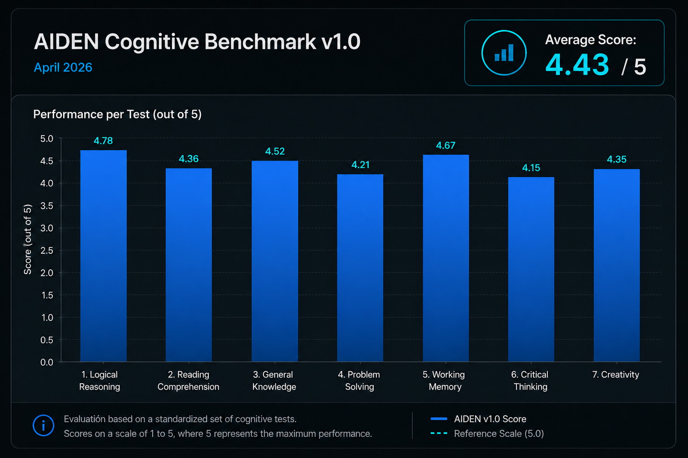
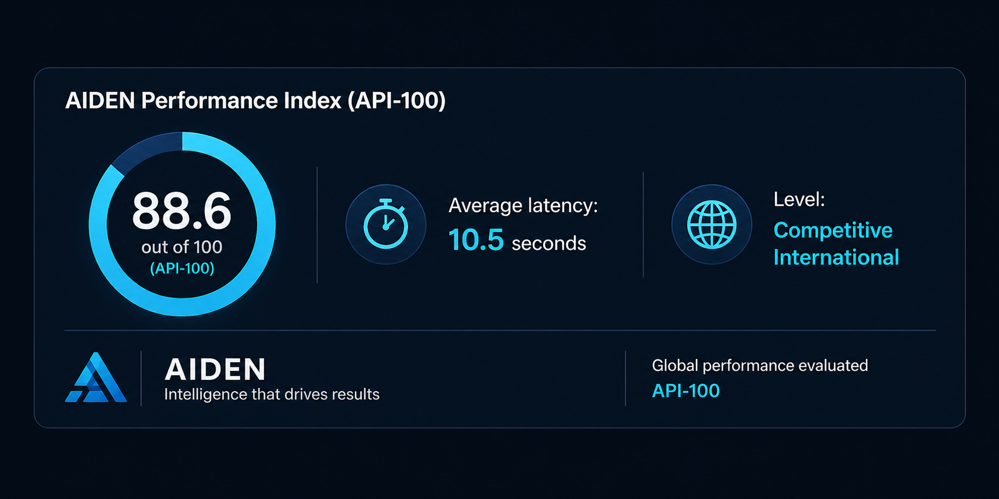
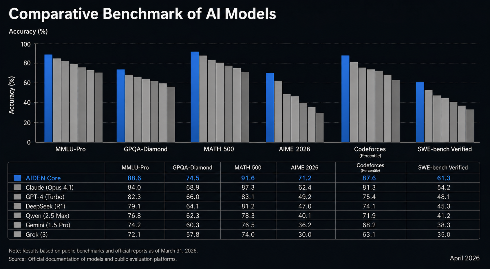

<p align="center">
  
</p>

<h1 align="center">
AIDEN Benchmark v1.0 — Cognitive Evaluation 2026
</h1>

<p align="center">
Real-world cognitive benchmark of AIDEN Core under non-optimized conditions.
</p>

<p align="center">


</p>

---

AIDEN Benchmark Core v1.0 is the first official cognitive evaluation conducted on AIDEN Core under real-world execution conditions.

This benchmark was designed to measure the foundational intelligence capabilities of the system, including reasoning quality, response consistency, latency behavior, structural stability, and explanatory performance across multiple conversational scenarios.

Unlike synthetic or laboratory-style evaluations, all tests were executed manually in a continuous production session without prompt optimization, allowing the benchmark to capture authentic system behavior under realistic conditions.

The objective of this evaluation is not only technical validation, but also transparency: providing researchers, developers, investors, and non-technical audiences with a clear view of AIDEN’s current cognitive capabilities, operational maturity, and real execution performance.

The results confirm that AIDEN Core operates as a functional conversational AI system with stable reasoning behavior, coherent language generation, and scalable architectural potential.


## Key Result

**API-100 Score: 88.6 / 100**  
**Performance Level: Competitive International**

---

## Highlights

- Real execution (no simulation)
- Manual testing
- Multi-query consistency
- Latency measured per interaction

## Overview

This benchmark evaluates the cognitive performance of AIDEN under real-world execution conditions.

Unlike simulated or controlled environments, all tests were conducted manually in a single continuous session, capturing:

- Response quality
- Latency per query
- Structural consistency
- Behavioral stability

A second validation round was executed using visual evidence (screens captures), ensuring reproducibility and reliability.

This methodology prioritizes **authentic system behavior over artificial optimization**.

---

## Methodology

<table width="100%">
<tr>

<td width="50%" valign="top">

### ⚙️ Execution Model

| Parameter | Details |
|---|---|
| Testing Type | Manual testing |
| Session Style | Single continuous session |
| Environment | Real production |
| Prompt Optimization | None |

</td>

<td width="50%" valign="top">

### 🧠 Evaluation Dimensions

| Dimension | Evaluated |
|---|---|
| Comprehension | ✔ |
| Reasoning | ✔ |
| Explanation Clarity | ✔ |
| Applied Knowledge | ✔ |

</td>

</tr>
</table>

<br>

### 📊 Data Captured

- **Response Content →** Full generated outputs recorded  
- **Latency →** Measured in seconds for each interaction  
- **Qualitative Score →** Human evaluation using a 1–5 scale  


---


## 📊 Benchmark Visualization

<p align="center">
  
</p>

### Key Metrics

- **Average Score:** 4.43 / 5  
- **API-100 Index:** 88.6 / 100  
- **Performance Level:** Competitive International  
- **Average Latency:** ~10.5 seconds  
- **Consistency:** High  

---

## Score Distribution

P1 ████████░░ 4

P2 ██████████ 5

P3 ████████░░ 4

P4 ████████░░ 4

P5 ██████████ 5

P6 ████████░░ 4

P7 ██████████ 5

<p align="center">
  
</p>

## Technical Observations

---

### ⚡ Latency Behavior

#### Observations
- **Simple queries →** Higher latency detected  
- **Complex queries →** Lower latency detected  

#### Interpretation
- **Token Generation →** Longer generation observed in simpler prompts  
- **Semantic Anchoring →** Stronger contextual anchoring in complex prompts  

---

### 🛡️ System Stability

#### Stability Analysis
- ✔ Stable across multiple sequential queries  
- ✔ No degradation detected after session reset  
- ✔ Consistent structural formatting maintained  

---

### ⚠️ Detected Imperfections (Validity Indicators)

#### Observed Issues
- Minor bullet formatting inconsistencies  
- Isolated conceptual inaccuracies  
- Structural repetition patterns detected  

#### Important Note
> These characteristics indicate **real execution behavior**, not synthetic benchmarking.

---

## Key Findings

- Strong natural language explanation capability
- Effective applied reasoning
- High structural clarity
- Minor precision gaps in scientific edge cases
- UI/output formatting still improvable

---

## Validation

### Real-World Execution Confirmation

The benchmark meets the following criteria:

- Real execution environment
- Direct response capture
- Measurable latency
- Human qualitative evaluation
- No post-processing or manipulation

### Methodological Declaration

> “All tests were executed manually in a real production environment, with direct logging of responses, latency, and human evaluation, without intervention or result modification.”

---

## Conclusion

AIDEN achieved an **API-100 score of 88.6**, placing it in the **Competitive International** tier.

The system demonstrates:

- Robust reasoning capabilities
- High-quality explanatory output
- Stable multi-query performance

<p align="center">
  
</p>

This benchmark validates AIDEN as a **functional and scalable AI system.**

---

# 🔒 Integrity Layer (Advanced Validation)

## 📸 Visual Evidence

Benchmark execution was validated using real screenshot captures from live testing sessions.

### Evidence Access

- 📂 [View Screenshots](evidence/)
- 📄 [Raw Benchmark Outputs](evidence/benchmark_v1_raw.txt)

---

## 🔐 Cryptographic Integrity

A real SHA-256 cryptographic hash was generated from the raw benchmark outputs to guarantee:

- Data immutability  
- Post-execution integrity  
- No post-editing validation  

### Hash Verification

- 🔑 [View SHA-256 Hash](evidence/sha256.txt)

### Validation Method

```bash
SHA-256(raw_outputs) → immutable verification fingerprint
```

This process provides an additional integrity layer commonly used in professional benchmarking, cybersecurity, and digital evidence verification workflows.

---

# Official Links

- 🌐 Official Website: https://www.jmcstudiocreativo.com/aiden-inteligencia-artificial-latina
- 💼 JMC Studio Creativo: https://www.jmcstudiocreativo.com
- 📫 Contact: contacto@jmcstudiocreativo.com

---

# Proprietary License

AIDEN is proprietary technology developed by Agencia Digital JMC Studio Creativo.

All rights are reserved. Commercial use, redistribution, deployment, model replication, or infrastructure integration require explicit written authorization.

See the LICENSE file for additional details.

---

# Final Statement

AIDEN represents an independent Latin American initiative focused on building scalable conversational artificial intelligence systems through real-world testing, benchmark validation, and voice-centered interaction research.

The current phase prioritizes technical maturity, infrastructure scalability, and ecosystem evolution based on validated development rather than speculative claims.

It is worth noting that AIDEN is, to date, a project entirely self-funded by its founder.

---

<p align="center">
  <b>© 2026 JMC Studio Creativo — AIDEN AI Latina from Guayaquil, Ecuador.</b>
</p>
